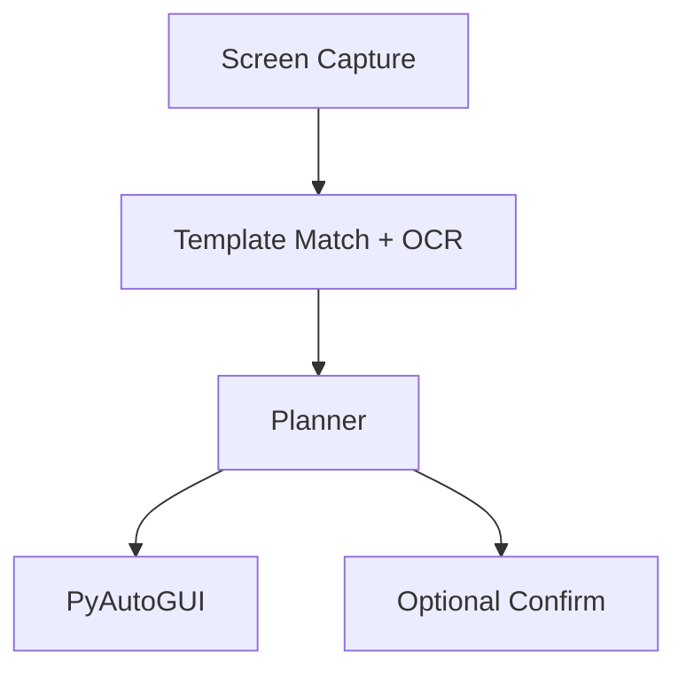

# win-vision-agent

Local desktop automation that controls Windows apps by reading the screen. No cloud and no APIs required. Uses OpenCV for detection, Tesseract for OCR, and PyAutoGUI to move and click.

## Demo
Add a short GIF in /assets showing the agent opening Notepad, typing, and saving a file.

## Problem
Traditional RPA breaks when pixels move. We want a resilient agent that matches templates, reads text, and asks for human approval when uncertain.

## Features
- Screenshot and region search with template matching
- OCR of UI text to choose the right element
- Actions: click, type, wait, hotkeys
- Safety: confidence thresholds and optional confirm step

## Quick start
```bash
python -m venv .venv
source .venv/bin/activate  # Windows: .venv\Scripts\activate
pip install -r requirements.txt
python scripts/demo_notepad.py
```

## Config
Place templates under `templates/`. Update `config.yaml` for thresholds.

## Tests
Add pytest tests for the vision functions under `tests/`.

## Architecture


## Roadmap
- Add YOLO model for robust UI element detection
- Add recording tool that turns actions into YAML
- Add Linux and macOS support

## License
MIT
